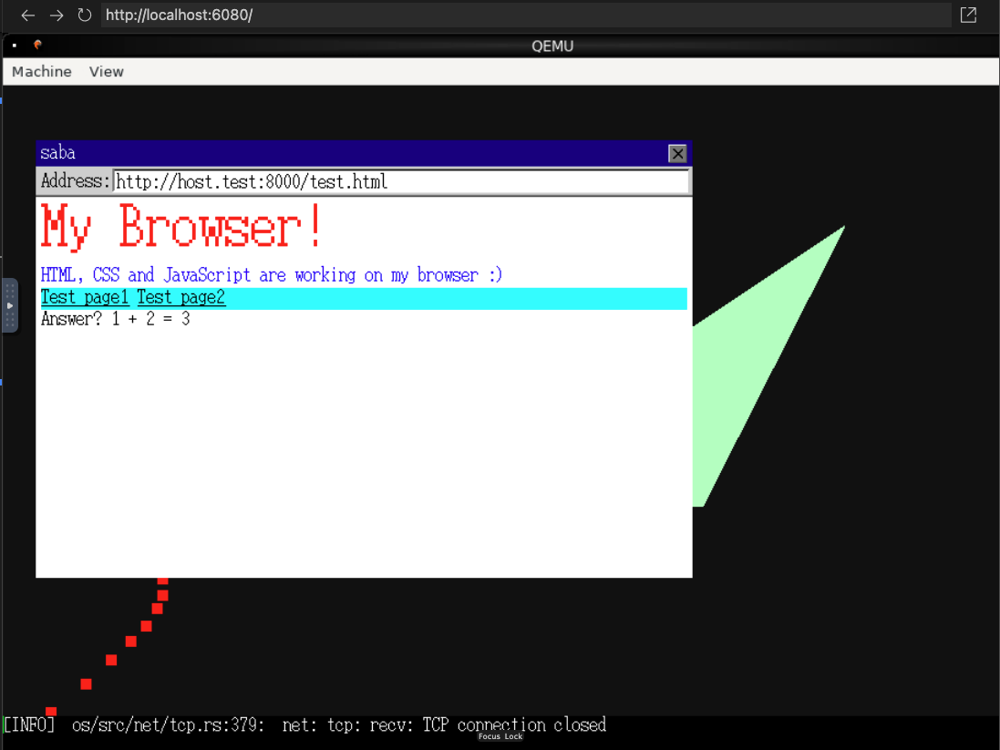

# SaBA (Sample Browser Application)

本リポジトリは書籍『[［作って学ぶ］ブラウザのしくみ──HTTP、HTML、CSS、JavaScriptの裏側](https://amzn.asia/d/dcEmU3E)』で解説されているソースコードである[saba](https://github.com/d0iasm/saba)リポジトリをForkし、Dockerで動かせるようにしたり、一部動作しない箇所を修正したりしたものです。

# Quick Start

```sh
git clone https://github.com/sbleru/sababook
cd sababook
```

## Dockerで立ち上げる場合

最終ゴール


デモ動画
https://youtu.be/yObiqurYELY


1. Dockerコンテナを立ち上げる

```sh
# 初回のみでOK
docker compose build
docker compose up -d
```

2. ブラウザで http://localhost:6080 にアクセスし、「接続」ボタンを押しておく

3. コンテナ内のシェルに接続

```sh
docker compose exec saba-dev bash
```

4. コンテナ内で各章のブラウザアプリケーションのシミュレーターを実行（ここでは7章を指定）

```sh
# 他の章を指定する場合は、「ch7」の部分を適宜置き換える
python3 -m http.server 8000 -d ch7/saba & pid=$!; trap "kill $pid" INT; ./docker/run_on_docker.sh ch7/saba; kill $pid
```

5. ブラウザアプリケーションを起動する

```sh
saba
```

6. 2.のブラウザに戻り、表示されているブラウザアプリケーションのAddressバーを選択し、「`http://host.test:8000/test.html`」を入力してEnterを押す

7. ブラウザアプリケーションのページが表示される
最終ゴールのような表示がされる

## MacOSで立ち上げる場合

1. 事前準備（必要なもののみ、初回のみでok）

```sh
# Rustをインストールする
curl --proto '=https' --tlsv1.2 -sSf https://sh.rustup.rs | sh
# QEMUをインストールする
brew install qemu
# Gitをインストールする
brew install git
```

2. 各章のブラウザアプリケーションのシミュレーターを実行（ここでは7章を指定）

```sh
# 他の章を指定する場合は、「ch7」の部分を適宜置き換える
cd ch7/saba
python3 -m http.server 8000 & export DISPLAY=0 && ./run_on_wasabi.sh
```

5. ブラウザアプリケーションを起動する

```sh
saba
```

6. 起動したブラウザアプリケーションのAddressバーを選択し、「`http://host.test:8000/test.html`」を入力してEnterを押す

7. ブラウザアプリケーションのページが表示される
